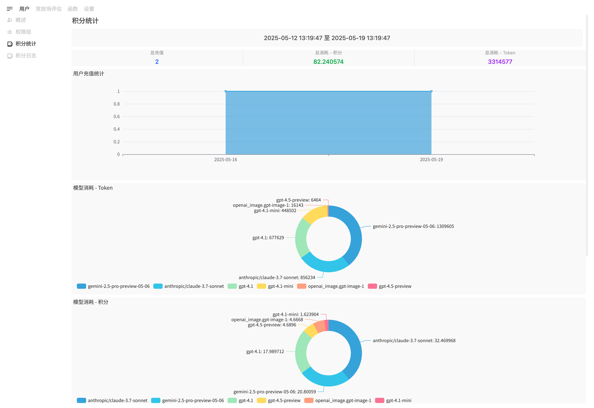
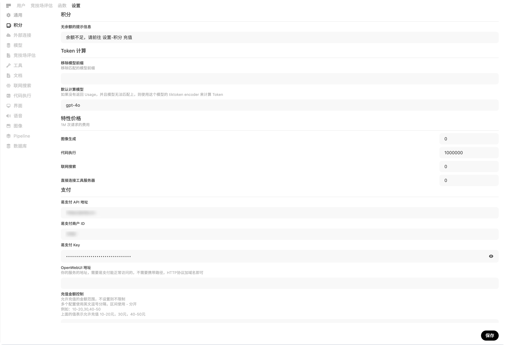
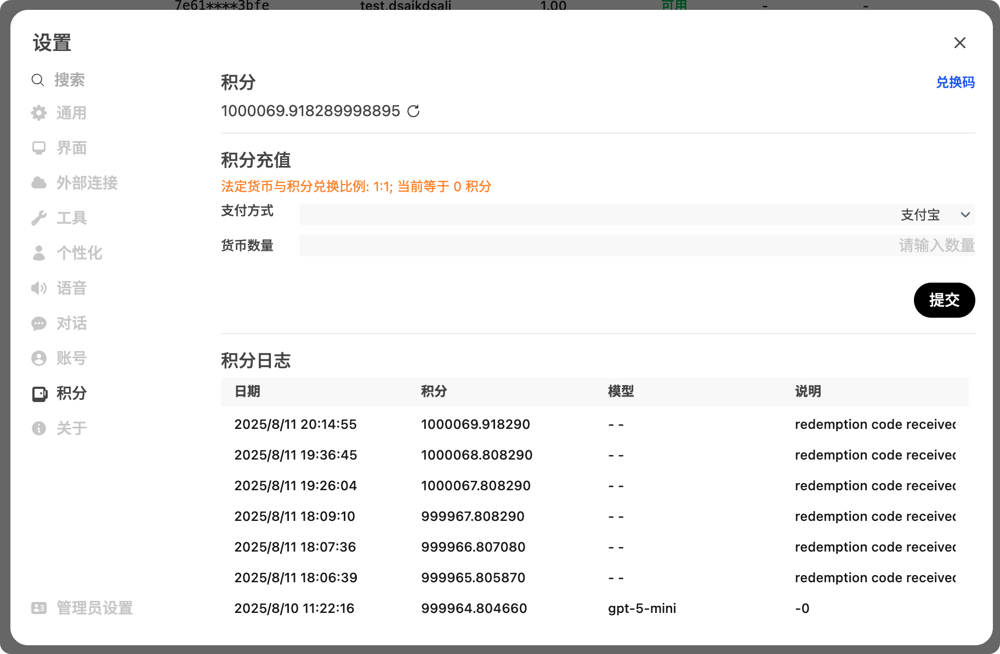
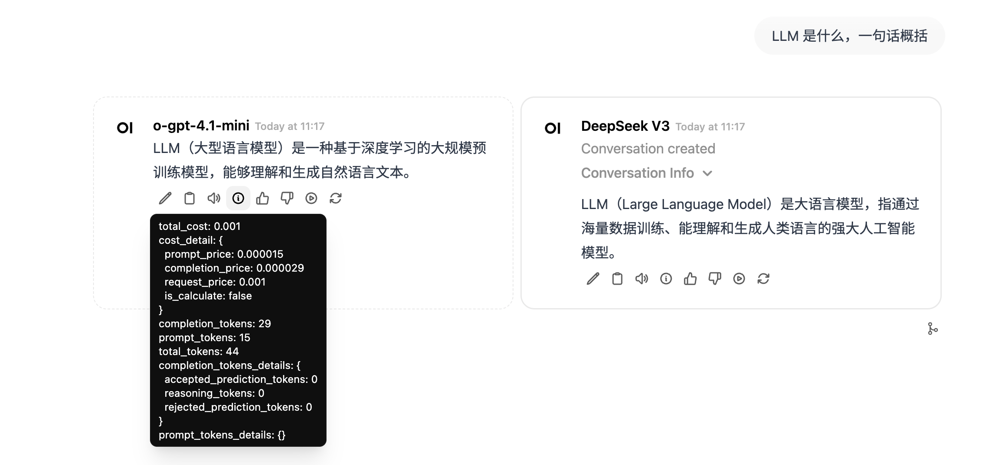
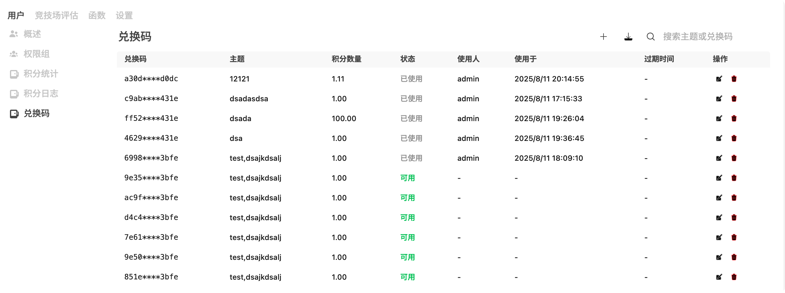
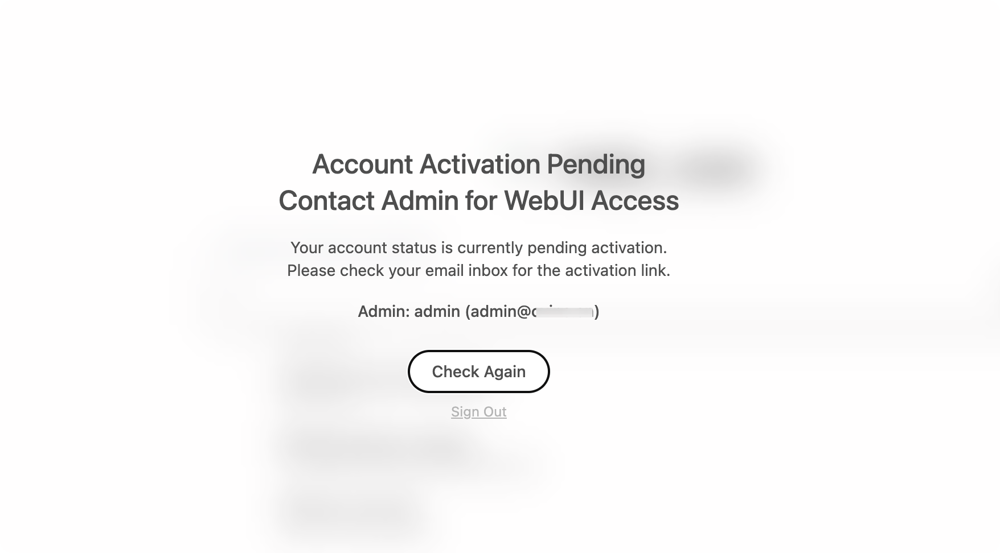

<div align="center">
  <a href="https://github.com/zhizinan1997/RyanAI">
    
  </a>

  <h1 align="center">RyanAI</h1>

  <p align="center">
    <strong>面向自托管与运营场景的 AI 工作台</strong>
  </p>

  <p align="center">
    <a href="https://github.com/zhizinan1997/RyanAI/releases">
      
    </a>
    <a href="https://github.com/zhizinan1997/RyanAI/blob/main/LICENSE">
      
    </a>
    <a href="https://github.com/zhizinan1997/RyanAI/pkgs/container/ryanai">
      
    </a>
  </p>
</div>

## 项目定位

RyanAI 是一个可自托管的 AI 对话、知识库与运营管理平台，适合个人开发者、团队和服务提供者搭建自己的 AI 应用入口。

它不再以“Open WebUI 二开版”作为项目定义。仓库里仍然保留 `backend/open_webui`、`OPEN_WEBUI_PORT` 等历史命名，是为了兼容现有数据、迁移脚本、包结构和部署生态；当前项目的产品方向、功能重点与发布节奏以 RyanAI 为准。

生产环境建议使用 [Release](https://github.com/zhizinan1997/RyanAI/releases) 中的正式版本。`dev` 或开发分支可能包含未稳定的功能。

## 核心能力

| 模块              | 能力                                                                                       |
| :---------------- | :----------------------------------------------------------------------------------------- |
| AI 对话与模型接入 | 支持 Ollama、OpenAI 兼容接口以及多类模型服务的统一管理。                                   |
| 知识库与文件处理  | 支持文档解析、向量检索、RAG、网页检索和多格式内容处理。                                    |
| 工具与扩展        | 支持 OpenAPI 工具服务、函数、代码执行、终端和工作区能力。                                  |
| 积分计费          | 支持按 Token、请求次数、Embedding、图片生成、代码执行、网页搜索和工具调用计费。            |
| 自定义定价        | 支持模型价格、最低消费、初始积分、特性价格，以及基于请求 Body 的 JSONPath 自定义计费规则。 |
| 充值与支付        | 支持易支付和支付宝当面付/订单码支付，可配置回调地址、金额限制和兑换比例。                  |
| 用户运营          | 支持邮箱验证注册、邮箱域名白名单、兑换码、用户积分与消费记录管理。                         |
| 数据报表          | 提供积分消耗、Token 使用、充值流水、模型消耗和用户维度统计。                               |
| 品牌配置          | 支持自定义站点名称、组织名称和 Logo，详见 [docs/BRANDING.md](./docs/BRANDING.md)。         |

## 功能预览

<details>
<summary>展开截图</summary>

### 积分报表与全局设置

|                积分报表                |                  全局设置                  |
| :------------------------------------: | :----------------------------------------: |
|  |  |

### 用户充值与计费详情

|                用户充值                |          计费详情          |
| :------------------------------------: | :------------------------: |
|  |  |

### 兑换码与注册验证

|                  兑换码                   |               邮箱验证                |
| :---------------------------------------: | :-----------------------------------: |
|  |  |

</details>

## 快速部署

### Docker Compose

```bash
git clone https://github.com/zhizinan1997/RyanAI.git
cd RyanAI
cp .env.example .env
docker compose up -d --build
```

启动后访问 `http://localhost:3000`。Compose 默认会同时启动 Ollama，并把 RyanAI 的容器内 `8080` 端口映射到宿主机 `3000`。

Windows PowerShell 可用：

```powershell
Copy-Item .env.example .env
docker compose up -d --build
```

### 使用镜像运行

```bash
docker run -d \
  -p 3000:8080 \
  --add-host=host.docker.internal:host-gateway \
  -v ryanai:/app/backend/data \
  -e OLLAMA_BASE_URL=http://host.docker.internal:11434 \
  -e WEBUI_SECRET_KEY=replace-with-a-long-random-secret \
  --name ryanai \
  --restart unless-stopped \
  ghcr.io/zhizinan1997/ryanai:main
```

生产环境请把 `main` 替换为明确的 Release 版本号，并妥善设置 `WEBUI_SECRET_KEY`。应用数据默认持久化在容器内 `/app/backend/data`，上面的命令会映射到 Docker volume `ryanai`。

## 本地开发

### 环境要求

- Node.js `>=18.13.0 <=22.x.x`
- npm `>=6.0.0`
- Python `>=3.11, <3.13`
- Docker 可选，用于完整部署和依赖服务

### 前端

```bash
npm ci
npm run dev
```

### 后端

```bash
python -m venv .venv
source .venv/bin/activate
pip install -r backend/requirements.txt
python -m uvicorn open_webui.main:app --app-dir backend --host 0.0.0.0 --port 8080 --reload
```

Windows PowerShell 激活虚拟环境：

```powershell
.\.venv\Scripts\Activate.ps1
```

## 常用配置

基础环境变量可从 [.env.example](./.env.example) 开始调整：

| 变量                  | 说明                                         |
| :-------------------- | :------------------------------------------- |
| `OLLAMA_BASE_URL`     | 后端连接 Ollama 的地址。                     |
| `OPENAI_API_BASE_URL` | OpenAI 兼容接口地址。                        |
| `OPENAI_API_KEY`      | OpenAI 兼容接口密钥。                        |
| `WEBUI_SECRET_KEY`    | 会话与令牌签名密钥，生产环境必须固定且保密。 |
| `CORS_ALLOW_ORIGIN`   | 跨域来源配置。                               |
| `OPEN_WEBUI_PORT`     | Docker Compose 暴露端口，默认 `3000`。       |

更多配置可以在管理员面板中完成，包括模型接入、积分、支付、SMTP、用户权限、工作区和工具服务。

## 运营配置

### 积分与价格

管理员入口：`管理面板 -> 设置 -> 积分`。

可配置内容包括：

- 初始积分、充值兑换比例、余额不足提示、空响应是否计费。
- 模型输入/输出/缓存 Token 价格。
- Embedding、图片生成、代码执行、网页搜索、工具服务等特性价格。
- 单次请求最低消费。
- 自定义 JSONPath 计费规则。

自定义计费示例：

```json
[
	{
		"name": "web_search",
		"path": "$.tools[*].type",
		"exists": false,
		"value": "web_search_preview",
		"cost": 1000000
	}
]
```

### 支付回调

易支付回调地址：

```text
https://your-domain.com/api/v1/credit/callback
```

支付宝回调地址：

```text
https://your-domain.com/api/v1/credit/callback/alipay
```

支付宝私钥请使用 PKCS#1 格式。`ALIPAY_CALLBACK_HOST` 和 `EZFP_CALLBACK_HOST` 应填写可被支付平台公网访问的站点根地址，例如 `https://your-domain.com`，不要附加路径。

### 邮箱验证

管理员入口：`管理面板 -> 设置 -> 通用`。

开启注册邮箱验证后，需要配置：

- `SMTP_HOST`
- `SMTP_PORT`
- `SMTP_USERNAME`
- `SMTP_PASSWORD`
- `SMTP_SENT_FROM`
- `SIGNUP_EMAIL_DOMAIN_WHITELIST`，可选，用于限制注册邮箱域名

## 项目结构

```text
.
├── src/                    # Svelte 前端
├── backend/open_webui/      # FastAPI 后端，保留历史包名以兼容迁移和构建
├── docs/                   # 品牌说明、截图与安全文档
├── scripts/                # 构建和资源准备脚本
├── static/                 # 静态资源
├── docker-compose.yaml     # 默认 Docker Compose 部署
├── Dockerfile              # 前后端一体镜像构建
├── package.json            # 前端与构建脚本
└── pyproject.toml          # Python 项目元数据
```

## 测试与质量检查

```bash
npm run check
npm run test:frontend
npm run lint:backend
```

`npm run lint:frontend` 会按项目脚本自动修复部分前端格式和 lint 问题，提交前建议先检查 diff。

## 升级建议

升级前请备份 `/app/backend/data` 对应的数据卷或目录。使用 Docker Compose 时可执行：

```bash
docker compose pull
docker compose up -d --build
```

如果使用固定 Release 镜像，请先修改镜像 tag，再重新启动服务。

## 文档

- [品牌配置](./docs/BRANDING.md)
- [安全策略](./docs/SECURITY.md)
- [故障排查](./TROUBLESHOOTING.md)
- [额外更新记录](./CHANGELOG_EXTRA.md)
- [完整更新记录](./CHANGELOG.md)

## 许可证

本仓库的授权条款以根目录 [LICENSE](./LICENSE)、[LICENSE_HISTORY](./LICENSE_HISTORY) 和 [LICENSE_NOTICE](./LICENSE_NOTICE) 为准。部署、分发、改名或移除标识前，请先阅读相关条款。

## 致谢

RyanAI 的早期代码、工程经验和生态兼容性受益于 [Open WebUI](https://github.com/open-webui/open-webui) 项目及其社区。感谢 Open WebUI Inc.（OVInc）、Timothy Jaeryang Baek 和所有相关贡献者为自托管 AI WebUI 生态打下基础。

RyanAI 会在尊重上游贡献和许可证要求的前提下，继续按照自己的产品定位演进：更关注中文运营场景、积分计费、支付闭环、用户管理和团队可落地部署。
