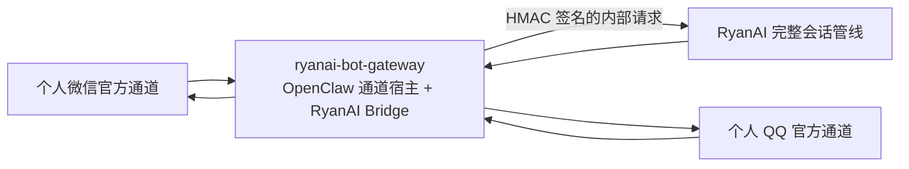

# 个人微信 / QQ 消息网关部署指南

RyanAI Bot Gateway 把个人微信和个人 QQ 的官方机器人通道接入 RyanAI。它只负责接收、标准化和转发消息；聊天记录、账号权限、积分、记忆、模型和服务端工具仍由 RyanAI 处理。

> 本功能面向腾讯官方开放的个人微信 / QQ 机器人能力，不支持企业微信，也不使用逆向协议、客户端 Hook 或模拟登录。账号能否开通、消息频率和可用能力受腾讯平台资格与政策约束。

## 架构和安全边界



- OpenClaw 只是微信官方插件所需的运行宿主，不配置模型，也不参与推理、记忆、工具调用或会话管理。Bridge 会在进入 OpenClaw Agent 前截获消息；RyanAI 不可用时不会回退到 OpenClaw Agent。
- 侧车端口仅通过 Compose 网络向 RyanAI 暴露，`docker-compose.yaml` 没有宿主机 `ports` 映射。不要自行把该端口公开到公网。
- RyanAI 和侧车共享 `BOT_GATEWAY_HMAC_SECRET`，用于验证内部请求。正常产品模式下账号凭据由 RyanAI 使用独立的 `BOT_GATEWAY_CREDENTIAL_MASTER_KEY` 加密保存在 SQL；侧车本地加密密钥用于单机兼容缓存和迁移，不会下发给 OpenClaw 子进程。
- 默认 `shared` 拓扑会让同一渠道的多个账号共享 OpenClaw 分片进程，并按连接公平排队；可通过 `BOT_GATEWAY_OPENCLAW_TOPOLOGY=isolated` 临时回退到每连接一个进程。
- 多 Gateway 部署使用 Redis 的目标节点、租约和 fencing epoch 防止同一账号被两个节点同时轮询；单节点默认 `BOT_GATEWAY_COORDINATION_MODE=single`，不依赖 Redis。
- Gateway 按连接维护 5 分钟和 30 分钟衰减负载观测，并通过节点心跳上报事件速率、每分钟处理占用、附件流量、10 分钟错误数和连续错误。Redis 模式只接受当前租约 owner 且 assignment generation 一致的数据；单节点模式为尽力上报，不会因 RyanAI 暂时不可达而停止运行。
- 总开关和两个渠道开关默认均为 `false`。启用时若 HMAC 密钥或凭据加密密钥为空，服务应拒绝启动通道，而不是采用默认密钥。

## 首次部署

1. 从示例创建本地环境文件：

   ```powershell
   Copy-Item .env.example .env
   ```

2. 分别生成两个独立的 32 字节随机密钥。安装了 OpenSSL 时可执行两次：

   ```console
   openssl rand -hex 32
   ```

   也可在 PowerShell 中执行以下命令两次：

   ```powershell
   $bytes = New-Object byte[] 32
   $rng = [Security.Cryptography.RandomNumberGenerator]::Create()
   $rng.GetBytes($bytes)
   ($bytes | ForEach-Object { $_.ToString('x2') }) -join ''
   $rng.Dispose()
   ```

3. 把两次生成的不同值写入 `.env`，然后按需开启渠道：

   ```dotenv
   BOT_GATEWAY_ENABLED=true
   BOT_GATEWAY_HMAC_SECRET=<第一个随机值>
   BOT_GATEWAY_CREDENTIALS_ENCRYPTION_KEY=<第二个随机值>
   BOT_GATEWAY_WECHAT_ENABLED=true
   BOT_GATEWAY_QQ_ENABLED=true
   ```

   不要把真实 `.env`、QQ AppSecret 或扫码数据提交到 Git。`BOT_GATEWAY_INTERNAL_PORT` 通常保持 `8787`；即使修改，它仍只在 Compose 网络内可见。

4. 验证配置并启动：

   ```console
   docker compose config
   docker compose pull ryanai-bot-gateway
   docker compose up -d
   docker compose ps
   ```

   `ryanai-bot-gateway` 会等待 `ryanai` 健康检查通过后启动。登录态写入命名卷，普通容器重建或重启不会要求重新扫码。

## 配置个人微信和 QQ

以 RyanAI 管理员登录，进入“管理后台 → 设置 → 集成”。

### 个人微信

1. 打开微信机器人连接并请求登录二维码。
2. 使用要作为机器人的个人微信扫码，并在手机端确认授权。
3. 等待连接状态变为“在线”，再用另一位联系人发送 `/help` 测试。

二维码会过期；过期后应在管理页面刷新，不能复用旧二维码。微信通道使用腾讯官方 [`@tencent-weixin/openclaw-weixin`](https://www.npmjs.com/package/@tencent-weixin/openclaw-weixin) 插件，OpenClaw 仅承载该插件。

### 个人 QQ

1. 按腾讯 [QQ Bot Agent 接入文档](https://bot.qq.com/wiki/agent-qqbot/) 创建或选择机器人应用，取得 AppID 和 AppSecret。
2. 在 RyanAI 的 QQ 集成卡片中录入 AppID / AppSecret。这里需要的是机器人应用凭据，不是个人 QQ 密码。
3. 按页面提示完成官方扫码或账号绑定，确认状态为“在线”。

凭据不会显示在 Compose 配置或浏览器响应中。更换 `BOT_GATEWAY_CREDENTIALS_ENCRYPTION_KEY` 后，旧凭据可能无法解密，需要重新录入并重新扫码。

## 用户绑定、群白名单和命令

每位联系人必须绑定自己的 RyanAI 正式账号，消息才会进入该用户的会话、权限和积分体系。用户先在 RyanAI 的机器人绑定设置中生成一次性绑定码，再私聊机器人发送：

```text
/bind <绑定码>
```

支持的网关命令不会调用模型，也不扣积分：

- `/bind <code>`：在私聊中绑定 RyanAI 账号。
- `/unbind`：发起解绑；按提示发送 `/unbind confirm` 确认。
- `/new`：开始新的 RyanAI 会话。
- `/model`：查看当前模型及可选模型。
- `/model <id>`：切换当前外部会话模型，仍受 RyanAI 模型权限约束。
- `/status`：查看绑定、模型和通道状态。
- `/help`：显示帮助。

群聊默认不响应。管理员需要在集成设置中把发现的群 ID 加入对应连接的白名单；白名单群内也只有明确 `@机器人` 的消息会被处理。群会话按“群 ID + 发送者”隔离，未绑定成员在群内不会触发回复。

## 首版限制

- 支持私聊及白名单群聊中的文字、图片和文件输入，回复为文字。
- 不支持语音、视频、定时任务或主动推送。
- 支持同一渠道配置多个机器人连接；默认每个共享分片最多 12 个账号，并由后端以 sticky、负载感知的方式规划分片。
- 调度器把负载折算为 `1..12` 单位；达到 8 单位或连续 3 次确定性账号错误时独立分片。分片连续 3 个一分钟窗口超过 120% 容量才拆分，连续 30 个窗口低于 40% 才允许合并；自动模式还受单次一个移动、两分钟间隔、每小时 10% 分片和连接移动后 30 分钟冷却限制。
- 依赖浏览器页面、浏览器 Socket 或人工确认的客户端工具不能直接在机器人会话中运行；RyanAI 可用的服务端工具仍走原有权限检查。
- 平台消息长度、附件大小、文件类型、频率限制和封禁策略同时受 RyanAI 与腾讯官方通道约束。

## 排障

先检查解析后的 Compose 配置和两端日志：

```console
docker compose config
docker compose ps
docker compose logs --tail=200 ryanai ryanai-bot-gateway
```

- **网关显示已禁用**：确认 `BOT_GATEWAY_ENABLED=true`，对应渠道开关为 `true`，两个随机密钥均非空，然后重建或重启两个服务。
- **侧车一直等待**：检查 RyanAI 的 `/health` 状态和 `docker compose logs ryanai`。侧车依赖 RyanAI 健康后才会启动。
- **扫码后仍离线**：刷新过期二维码，确认手机端完成授权；不要删除 `ryanai-bot-gateway` 卷。查看日志中是否有腾讯侧限流或资格提示。
- **QQ 鉴权失败**：重新核对 AppID / AppSecret、应用状态和官方账号绑定，确认容器可以访问腾讯公网接口且系统时间准确。
- **私聊无回复**：确认联系人已成功 `/bind`、RyanAI 用户未被禁用且仍有模型权限和额度。
- **群聊无回复**：同时检查群白名单、是否明确 `@机器人`、发送者是否已绑定。
- **重试后出现重复消息**：保留完整事件 ID 和时间附近的两端日志；不要通过删除数据卷来清理，因为卷中还包含登录态与幂等数据。
- **轮换 HMAC 密钥**：RyanAI 和侧车必须使用同一新值并同时重启，否则内部请求会因签名不匹配被拒绝。

如需确认侧车能访问 RyanAI，可执行：

```console
docker compose exec ryanai-bot-gateway node -e "fetch('http://ryanai:8080/health').then(async r => { console.log(r.status, await r.text()); process.exit(r.ok ? 0 : 1) }).catch(e => { console.error(e); process.exit(1) })"
```
